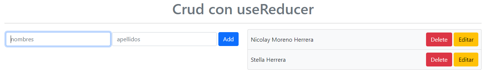

# **CRUD-USEREDUCER** :information_desk_person:

---

_Learning to use the Usereducer hook creating a CRUD using bootstrap with React Js_

  

---

---

[WEB-SITE](https://crudusereducer.netlify.app/ 'WEB-SITE')

  

---
